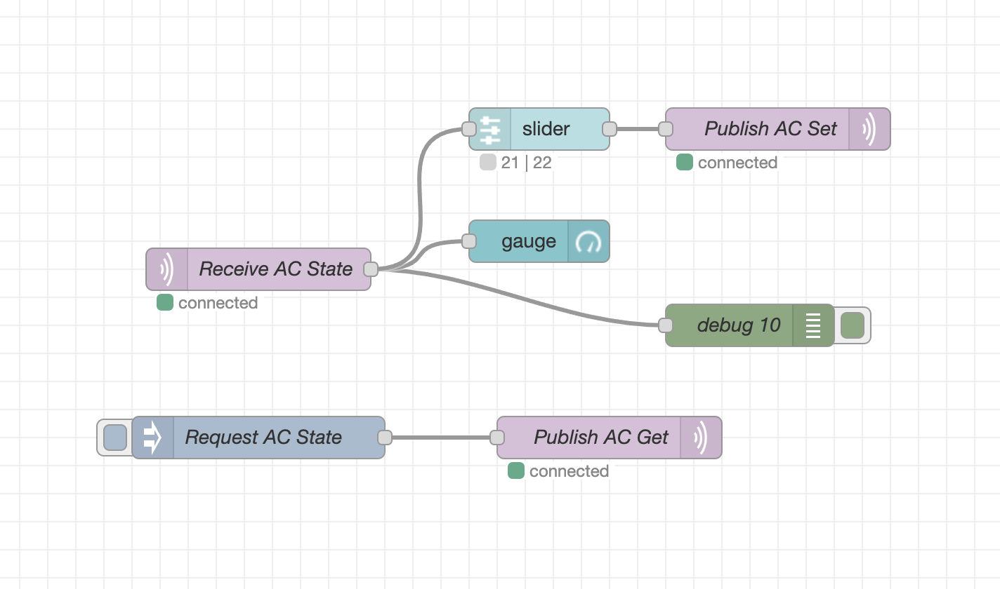

# 

### Start Mosquitto
```
brew services start mosquitto
```
### Stop Mosquitto

```
brew services stop mosquitto
```
### Restart Mosquitto
```
brew services restart mosquitto
```

### Start Node-RED
```
node-red
```
## Node-RED Flow


### Flow json

```json
[
    {
        "id": "ac_flow",
        "type": "tab",
        "label": "WS HA Dash",
        "disabled": false,
        "info": "AC Control flow for ESP32 Smart Home UI"
    },
    {
        "id": "075d3f038f0f994e",
        "type": "mqtt out",
        "z": "ac_flow",
        "name": "Publish AC Set",
        "topic": "home/ac/set",
        "qos": "2",
        "retain": "true",
        "respTopic": "",
        "contentType": "",
        "userProps": "",
        "correl": "",
        "expiry": "",
        "broker": "308ff2c0e759ae63",
        "x": 660,
        "y": 240,
        "wires": []
    },
    {
        "id": "efecd2140b90f207",
        "type": "mqtt in",
        "z": "ac_flow",
        "name": "Receive AC State",
        "topic": "home/ac/state",
        "qos": "2",
        "datatype": "auto",
        "broker": "308ff2c0e759ae63",
        "nl": false,
        "rap": false,
        "inputs": 0,
        "x": 290,
        "y": 340,
        "wires": [
            [
                "14930e44ce9d3eae",
                "a533b98661856664",
                "6588945e4a3b021e"
            ]
        ]
    },
    {
        "id": "48ba973e1ce560a3",
        "type": "inject",
        "z": "ac_flow",
        "name": "Request AC State",
        "props": [
            {
                "p": "payload"
            },
            {
                "p": "topic",
                "vt": "str"
            }
        ],
        "repeat": "",
        "crontab": "",
        "once": false,
        "onceDelay": 0.1,
        "topic": "",
        "payload": "",
        "payloadType": "str",
        "x": 290,
        "y": 460,
        "wires": [
            [
                "c6b2434de44d1ca6"
            ]
        ]
    },
    {
        "id": "c6b2434de44d1ca6",
        "type": "mqtt out",
        "z": "ac_flow",
        "name": "Publish AC Get",
        "topic": "home/ac/get",
        "qos": "2",
        "retain": "",
        "respTopic": "",
        "contentType": "",
        "userProps": "",
        "correl": "",
        "expiry": "",
        "broker": "308ff2c0e759ae63",
        "x": 540,
        "y": 460,
        "wires": []
    },
    {
        "id": "14930e44ce9d3eae",
        "type": "debug",
        "z": "ac_flow",
        "name": "debug 10",
        "active": true,
        "tosidebar": true,
        "console": false,
        "tostatus": false,
        "complete": "false",
        "statusVal": "",
        "statusType": "auto",
        "x": 640,
        "y": 380,
        "wires": []
    },
    {
        "id": "a533b98661856664",
        "type": "ui_gauge",
        "z": "ac_flow",
        "name": "",
        "group": "ac_controls",
        "order": 4,
        "width": 0,
        "height": 0,
        "gtype": "gage",
        "title": "gauge",
        "label": "°C",
        "format": "{{value}}",
        "min": "19",
        "max": "26",
        "colors": [
            "#0f6bff",
            "#0fe600",
            "#ca3838"
        ],
        "seg1": "",
        "seg2": "",
        "diff": false,
        "className": "",
        "x": 490,
        "y": 320,
        "wires": []
    },
    {
        "id": "6588945e4a3b021e",
        "type": "ui_slider",
        "z": "ac_flow",
        "name": "",
        "label": "slider",
        "tooltip": "",
        "group": "ac_controls",
        "order": 1,
        "width": 0,
        "height": 0,
        "passthru": false,
        "outs": "all",
        "topic": "responseTopic",
        "topicType": "msg",
        "min": "19",
        "max": "26",
        "step": 1,
        "className": "",
        "x": 490,
        "y": 240,
        "wires": [
            [
                "075d3f038f0f994e"
            ]
        ]
    },
    {
        "id": "308ff2c0e759ae63",
        "type": "mqtt-broker",
        "name": "",
        "broker": "192.168.100.41",
        "port": "1883",
        "clientid": "",
        "autoConnect": true,
        "usetls": false,
        "protocolVersion": "4",
        "keepalive": "60",
        "cleansession": true,
        "autoUnsubscribe": true,
        "birthTopic": "",
        "birthQos": "0",
        "birthRetain": "false",
        "birthPayload": "",
        "birthMsg": {},
        "closeTopic": "",
        "closeQos": "0",
        "closeRetain": "false",
        "closePayload": "",
        "closeMsg": {},
        "willTopic": "",
        "willQos": "0",
        "willRetain": "false",
        "willPayload": "",
        "willMsg": {},
        "userProps": "",
        "sessionExpiry": ""
    },
    {
        "id": "ac_controls",
        "type": "ui_group",
        "name": "AC Controls",
        "tab": "a1e5fa2e9b765fa9",
        "order": 2,
        "disp": true,
        "width": "8",
        "collapse": false,
        "className": ""
    },
    {
        "id": "a1e5fa2e9b765fa9",
        "type": "ui_tab",
        "name": "WA HA Dash",
        "icon": "dashboard",
        "order": 1,
        "disabled": false,
        "hidden": false
    }
]
```